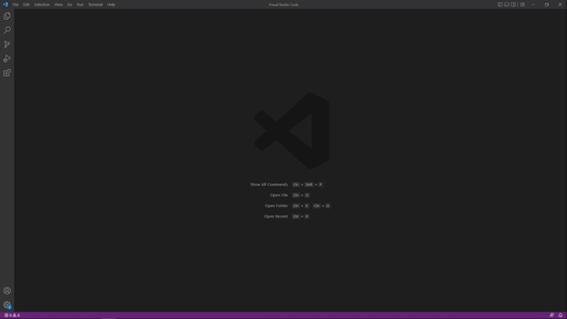
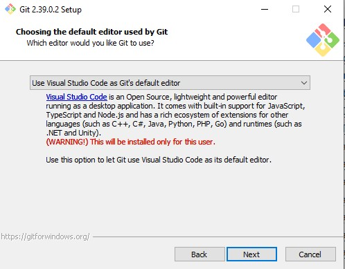
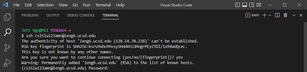
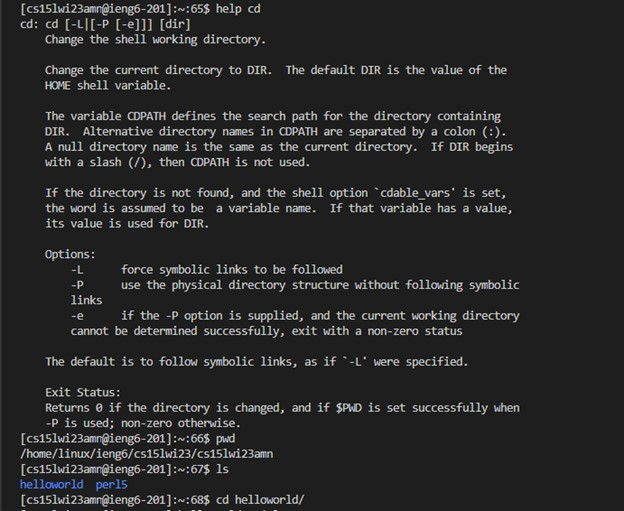

# Lab Report 1
## Installing VScode
To log into a course-specific account on ieng6, you need to install [Visual Studio Code, or VScode](https://code.visualstudio.com/download), on your computer; however, I already had VScode installed on my personal device so I did not need to do this. Once installed and opened, you should be able to see a screen like this.



If you are on Windows like I am, you need to install [Git](https://gitforwindows.org/) (*make sure to select VScode as Git’s default editor when installing Git*) and follow [this post](https://stackoverflow.com/a/50527994) to use git bash in VScode.



---
## Remotely Connecting
After selecting Git Bash as your default profile for your terminal on VScode, open the terminal(by pressing ctrl + \`) and type 
```
ssh cs15lwi23zz@ieng6.ucsd.edu 
```
replacing zz with the letters in your account, into your terminal. You may receive a message asking if you want to continue connecting, to which you can respond with yes. Then, enter your password after being prompted to do so (*you will not be able to see your password when you type it*).



---
## Trying out Some Commands
After you have logged in, you can now test some commands such as `cd`(which changes the directory that you are in), `ls`(which prints out the contents of a directory), `pwd`(which prints the working directoy(the directory you are currently in)), `mkdir`(which creates a new directory in your current directory), and `cp`(which allows you to copy files) to familiarize yourself with them. Feel free to type `help _____` in the terminal, filling in the blank with the command you want to know about, to see how to use different commands.


