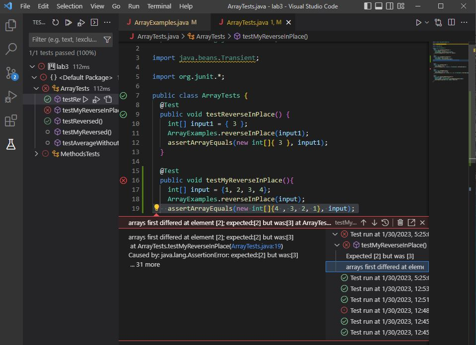

# Lab 2

## Part 1: Webserver

My `StringServer` code:

```
import java.io.IOException;
import java.net.URI;

class Handler implements URLHandler {
    String message = "";

    public String handleRequest(URI url) {
        if (url.getPath().contains("/add-message")) {
            String[] parameters = url.getQuery().split("=");
            if (parameters[0].equals("s")) {
                if(message.equals("")){
                    message = parameters[1];
                    return String.format(message);
                }
                else{
                    message = message + "\n" + parameters[1];
                    return String.format(message);
                }
            }
        }
        return "404 Not Found!";
    }
}
class StringServer {
    public static void main(String[] args) throws IOException {
        if(args.length == 0){
            System.out.println("Missing port number! Try any number between 1024 to 49151");
            return;
        }

        int port = Integer.parseInt(args[0]);

        Server.start(port, new Handler());
    }
}
```

**Using `/add-message`**


When using `/add-message` for the first time, the method `handleRequest(URI url)` is called. It handles a `URI` argument labeled `url`. The method `handleRequest(URI url)` is within the class `Handler` which implements `URLHandler`. In the `Handler` class, a String field called `message` exists which equals `""`, or an empty string. After using `/add-massage?s=How are you doing?`, `message` is updated to equal `"How are you doing?"`.


When using `/add-message` again, the method `handleRequest(URI url)` is called. It handles a `URI` argument labeled `url`. The method `handleRequest(URI url)` is within the class `Handler` which implements `URLHandler`. In the `Handler` class, a String field called `message` exists which now equals `"How are you doing?"`, as the previous `/add-message` updated the `message` variable. After using `/add-massage?s=Fine. And you?`, `message` is updated to equal `"How are you doing?\nFine. And you?"`. `\n` indicates a new line, meaning that the webpage will show the messages as:

```
How are you doing?
Fine. And you?
```
## Part 2: Bugs

**Failure Inducing Input**

Method (provided by [jpolitz](https://github.com/ucsd-cse15l-w23/lab3)):

```
  static void reverseInPlace(int[] arr) {
    for(int i = 0; i < arr.length; i += 1) {
      arr[i] = arr[arr.length - i - 1];
    }
  }
```
  
The test below contained a failure inducing input for the method above. The failure inducing input was an int array containg four ints: `{1, 2, 3, 4}`.

```
  @Test
  public void testMyReverseInPlace(){
    int[] input = {1, 2, 3, 4};
    ArrayExamples.reverseInPlace(input);
    assertArrayEquals(new int[]{4 , 3, 2, 1}, input);
  }
  ```
The  test below did not induce a failure in the method at the top of this section (this test was provided by [jpolitz](https://github.com/ucsd-cse15l-w23/lab3)). The input was an int array containing one int: `{3}`.

```
Test 
public void testReverseInPlace() {
int[] input1 = { 3 };
ArrayExamples.reverseInPlace(input1);
assertArrayEquals(new int[]{ 3 }, input1);
}
```
The image below contains the output of running the two tests above. The symptom of the bug is that the second half of the array is not reversed.



The method below(provided by [jpolitz](https://github.com/ucsd-cse15l-w23/lab3)) contains the bug:

```
  static void reverseInPlace(int[] arr) {
    for(int i = 0; i < arr.length; i += 1) {
      arr[i] = arr[arr.length - i - 1];
    }
  }
```

The method below resolves the bug by introducing a variable to store the data of the int being replaced, so that it is not lost. This allows the int being replaced to be reinserted back into the array. It also halves the end point of the `for` loop to prevent an `IndexOutOfBounds Exception`.

```
static void reverseInPlace(int[] arr) {
    for(int i = 0; i < arr.length/2; i += 1) {
      int back = arr[i];
      arr[i] = arr[arr.length - i - 1];
      arr[arr.length - i - 1] = back;
    }
} 
```

# Part 3

One thing I learned from lab in weeks 2 and 3 is that you can modify a webpage with a Java program. Whenever I would work with a website(ie. Google Sites), I always accessed and modified it through an interface provided by the website. It never occured to me that you could write a Java program that is linked to, interacts with, and modifies a webstie directly.
