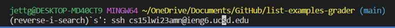
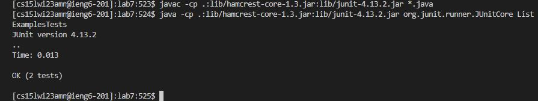
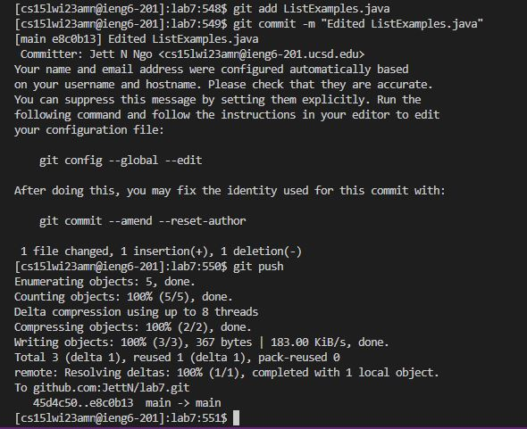

# Lab Report 4

## 4. Log into ieng6
Keys Pressed: `<Ctrl-R>` `s` `<enter>`

I used `<Ctrl-R>` to search my command history. By pressing `s` while searching my command history, bash autocompletes `s` to `ssh cs15lwi23amn@ieng6.ucsd.edu` (a command which will log me into ieng6) and I just have to press `<enter>` to get bash to run that command.

## 5. Clone your fork of the repository from your Github account

Keys Pressed: `git clone` `<space>` `<Ctrl-V>` `<enter>`

I typed `git clone` as `git clone` is the command used to clone a repository. Then I pressed `<space>` to create a space after `git clone` and pressed `<Ctrl-V>` to paste the SSH url. Then I pressed `<enter>` to run the full command `git clone git@github.com:JettN/lab7.git`.

## 6. Run the tests, demonstrating that they fail

Keys Pressed: `cd l` `<tab>` `<enter>` `<Ctrl-R>` `ja` `<enter>` `<Ctrl-R>` `java` `<space>` `<enter>`

After cloning my fork of the repository from my GitHub account, I typed `cd l` into my terminal then pressed tab to autocomplete that line to `cd lab7/` and pressed enter to execute that command. Then I used `<Ctrl-R>` and typed `ja` which brought up `javac -cp .:lib/hamcrest-core-1.3.jar:lib/junit-4.13.2.jar *.java`. I then pressed `<enter>` to run that command. Once the command ran, I used `<Ctrl-R>` and typed `java` then pressed `<space>` which brought up `java -cp .:lib/hamcrest-core-1.3.jar:lib/junit-4.13.2.jar org.junit.runner.JUnitCore ListExamplesTests`. I then pressed `<enter>` to run that command which provided the response below.

## 7. Edit the code file to fix the failing test

Keys Pressed: `<Ctrl-R>` `n` `<enter>` `<down>` x42 times(I held down the key) `<right>` x12 times `<backspace>` `2` `<Ctrl-O>` `<enter>` `<Ctrl-X>`

I used `<Ctrl-R>` and typed `n` which brought up `nano ListExamples.java` and I pressed `<enter>` to run that command. Once nano opened `ListExamples.java`, I held down `<down>` so that the cursor went down 42 lines. Then I pressed `<right>` 12 times to move my cursor before the `+=`. Then I pressed `<backspace>` to delete the `1` from `index1` and replaced the `1` with a `2` to get `index2`. Then I pressed `<Ctrl-O>` to save the edit I made and pressed `<enter>` to keep the file name (`ListExample.java`) the same. Then I pressed `<Ctrl-X>` to exit from the nano screen.

The image below shows the fixed file with my cursor next to the location I made the edit.

## 8. Run the tests, demonstrating that they now succeed

Keys Pressed: `<Ctrl-R>` `javac` `<enter>` `<Ctrl-R>` `java ` `<enter>`

I used `<Ctrl-R>` and typed `ja` which brought up `javac -cp .:lib/hamcrest-core-1.3.jar:lib/junit-4.13.2.jar *.java`. I then pressed `<enter>` to run that command. Once the command ran, I used `<Ctrl-R>` and typed `java` then pressed `<space>` which brought up `java -cp .:lib/hamcrest-core-1.3.jar:lib/junit-4.13.2.jar org.junit.runner.JUnitCore ListExamplesTests`. I then pressed `<enter>` to run that command which provided the response below.

## 9. Commit and push the resulting change to your Github account (you can pick any commit message!)

Keys Pressed: `git add L` `<tab>` `.java` `<enter>` `git commit -m "Edited ListExamples.java` `<enter>` `git push` `<enter>`

I typed `git add L` and pressed `<tab>` to autocomplete to `git add ListExamples` and then I manually typed `.java` after to get the command `git add ListExamples.java`. Then I pressed `<enter>` to run the command. `git add` is used to tell Git what files you want to commit. Then I typed `git commit -m "Edited ListExamples.java"` and pressed `<enter>` to run the command. `git commit` is the command to commit the changes I made to `ListExamples.java`. The `-m` tells Git that `"Edited ListExamples.java"` is the message I want to associate with the commit I am making. After committing, I typed `git push` and pressed `<enter>` to push the changed `ListExamples.java` to my Github account.

